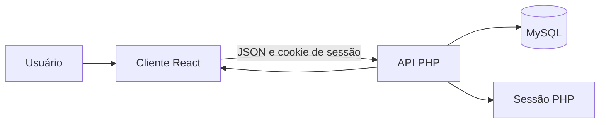
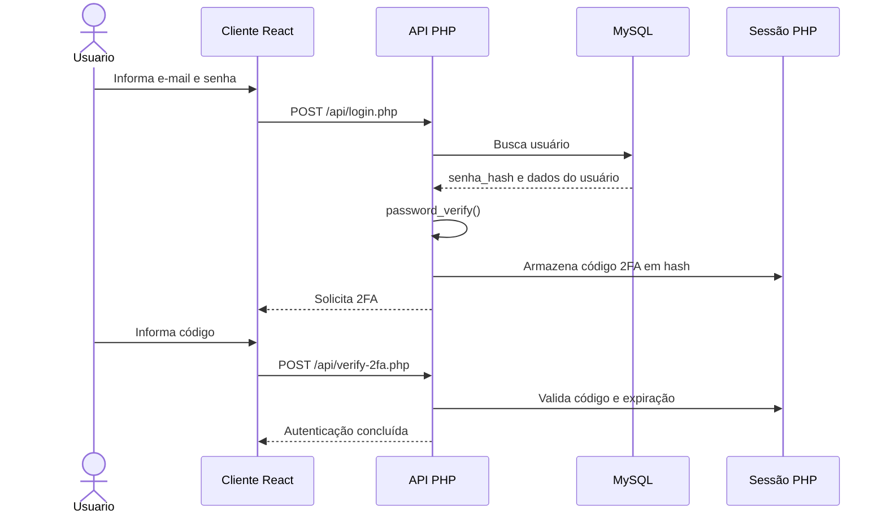

# Etapa 1: Autenticação e Gestão de Credenciais

## 1. Identificação do projeto

**Projeto:** Continuum  
**Área:** Segurança da informação aplicada à continuidade do cuidado em saúde  
**Finalidade:** apoiar a passagem de plantão entre profissionais de saúde, favorecendo a transmissão segura e padronizada de informações relevantes sobre os pacientes.

Este documento registra exclusivamente o atendimento dos requisitos da **Etapa 1 - Autenticação e Gestão de Credenciais**. As demais etapas da rubrica serão documentadas em arquivos próprios.

## 2. Escopo da etapa

Esta etapa contempla:

- cadastro de usuários com senha protegida;
- autenticação por e-mail e senha;
- autenticação em dois fatores (2FA);
- controle de sessão e expiração por inatividade;
- logout com invalidação da sessão;
- proteção contra tentativas consecutivas de login;
- justificativas técnicas e evidências funcionais.

## 3. Arquitetura relacionada à autenticação

O fluxo utiliza um cliente React, uma API REST em PHP, sessões mantidas pelo servidor e um banco MySQL.



### Arquivos envolvidos

| Camada | Arquivo | Responsabilidade |
| --- | --- | --- |
| Cliente | `apps/Client/src/pages/Login/index.jsx` | Login e validação do 2FA |
| Cliente | `apps/Client/src/services/utils/auth.jsx` | Consulta da sessão e logout |
| Servidor | `apps/Server/api/register.php` | Cadastro e hash da senha |
| Servidor | `apps/Server/api/login.php` | Login, 2FA e proteção contra força bruta |
| Servidor | `apps/Server/api/verify-2fa.php` | Validação do código e autenticação definitiva |
| Servidor | `apps/Server/api/session.php` | Verificação e expiração da sessão |
| Servidor | `apps/Server/api/logout.php` | Encerramento da sessão |
| Servidor | `apps/Server/config/database.php` | Conexão PDO com o MySQL |

## 4. Fluxo de autenticação

1. O usuário informa e-mail e senha no cliente React.
2. A API busca o usuário por e-mail usando uma instrução preparada.
3. A senha informada é comparada com o hash armazenado por meio de `password_verify`.
4. Após a autenticação primária, a API gera um código de seis dígitos.
5. O código é armazenado em hash na sessão temporária e expira em cinco minutos.
6. O cliente solicita o código de 2FA ao usuário.
7. `verify-2fa.php` valida o código e cria a sessão autenticada.
8. Os dados temporários do 2FA são removidos após o sucesso.
9. A sessão é verificada a cada consulta e expira após 30 minutos de inatividade.
10. O logout limpa os dados, remove o cookie e destrói a sessão no servidor.



## 5. Matriz de conformidade da Etapa 1

Legenda: **Atendido** indica implementação verificável no código. **Parcial** indica que existe implementação ou documentação, mas ainda falta uma evidência ou melhoria para a entrega final.

| Nº | Requisito | Status | Implementação ou evidência |
| --- | --- | --- | --- |
| 1.1 | Uso de hash criptográfico seguro para senhas | **Atendido** | `register.php` utiliza `PASSWORD_ARGON2ID`. |
| 1.2 | Parâmetros de custo do hash configurados e justificados | **Atendido** | `memory_cost=65536`, `time_cost=4` e `threads=2` estão definidos no cadastro e justificados na seção 6. |
| 1.3 | Uso de salt criptográfico único por usuário | **Atendido** | `password_hash` gera e incorpora um salt aleatório para cada senha. |
| 1.4 | Armazenamento correto do hash + salt | **Atendido** | O valor completo produzido por `password_hash` é armazenado em `usuarios.senha_hash`. |
| 1.5 | Autenticação de dois fatores (2FA) implementada | **Atendido** | O login encaminha o usuário para a etapa de validação em `verify-2fa.php`. |
| 1.6 | Validação do 2FA após autenticação primária | **Atendido** | A sessão autenticada só é criada depois da validação do código. |
| 1.7 | Fluxo de autenticação documentado | **Atendido** | O fluxo está descrito na seção 4 e representado no diagrama de sequência. |
| 1.8 | Evidências funcionais | **Parcial** | Prints, logs e testes devem ser adicionados à pasta `docs/Evidencias/`. |
| 1.9 | Sessões com tempo de expiração | **Atendido** | `session.php` encerra a sessão após 30 minutos de inatividade. |
| 1.10 | Invalidação de sessão no logout | **Atendido** | `logout.php` limpa os dados, remove o cookie e executa `session_destroy`. |
| 1.11 | Proteção contra força bruta | **Atendido** | Após cinco tentativas, a API retorna HTTP 429 e bloqueia novas tentativas por 60 segundos. |
| 1.12 | Justificativas técnicas documentadas | **Atendido** | As decisões de segurança estão justificadas na seção 6. |

## 6. Justificativas técnicas

### 6.1 Hash Argon2id e salt

O projeto utiliza Argon2id para armazenamento de senhas. Esse algoritmo aplica custo de memória, tempo e paralelismo, dificultando ataques de força bruta e ataques com hardware especializado. A senha original nunca é armazenada.

Os parâmetros atuais são:

```text
memory_cost = 65536
time_cost   = 4
threads     = 2
```

Essa configuração é uma referência inicial para o ambiente de desenvolvimento. Antes da publicação em produção, os valores devem ser reavaliados por benchmark no servidor utilizado, equilibrando segurança e tempo de resposta.

O salt é gerado automaticamente pelo PHP durante o uso de `password_hash`. Como o resultado completo é salvo em `senha_hash`, o salt permanece associado ao hash sem precisar de uma coluna separada.

### 6.2 Autenticação em dois fatores

O segundo fator é solicitado somente depois do sucesso da autenticação por e-mail e senha. O código possui seis dígitos, é gerado com `random_int`, é armazenado em hash e permanece válido por cinco minutos. Após a validação, os dados temporários do 2FA são removidos da sessão.

No ambiente atual, o código é retornado no campo `codigo_teste` para permitir testes locais. Esse comportamento é exclusivo de desenvolvimento e deve ser removido antes da publicação em produção, substituindo-o por envio via e-mail, aplicativo autenticador ou outro canal controlado.

### 6.3 Sessões e logout

O cookie de sessão utiliza `HttpOnly` e `SameSite=Lax`. O identificador da sessão é regenerado durante a transição para a autenticação definitiva. A sessão expira após 30 minutos de inatividade.

No logout, a aplicação limpa os dados da sessão, invalida o cookie do navegador e executa `session_destroy`, impedindo a reutilização da sessão encerrada.

### 6.4 Proteção contra força bruta

O endpoint de login contabiliza as tentativas na sessão. Ao atingir cinco tentativas, a API retorna HTTP 429 e bloqueia novas tentativas por 60 segundos. Essa medida reduz a velocidade de ataques automatizados no ambiente atual.

## 7. Evidências funcionais

As imagens, capturas de tela, logs e resultados de testes referentes exclusivamente à Etapa 1 devem ser armazenados na pasta:

`docs/evidence/Requisitos_01`

```text
docs/
└── Evidencias/
    ├── 01-tela-cadastro.png
    ├── 02-cadastro-preenchido.png
    ├── 03-tela-login.png
    ├── 04-testes-email.png
    ├── 05-login-e-2f2.png
    ├── 06-login-home.png
    └── 07-requisitos-senha.png
```

Cada evidência deve informar o requisito relacionado, a data, o ambiente e o resultado observado. Não devem ser incluídas senhas reais, tokens válidos, códigos de 2FA ou dados pessoais reais.

## 8. Referências técnicas

1. PHP. **password_hash**. Documentação oficial. Disponível em: <https://www.php.net/manual/en/function.password-hash.php>. Acesso em: 28 ago. 2026.
2. OWASP Foundation. **Authentication Cheat Sheet**. Disponível em: <https://cheatsheetseries.owasp.org/cheatsheets/Authentication_Cheat_Sheet.html>. Acesso em: 28 ago. 2026.
3. OWASP Foundation. **Password Storage Cheat Sheet**. Disponível em: <https://cheatsheetseries.owasp.org/cheatsheets/Password_Storage_Cheat_Sheet.html>. Acesso em: 28 ago. 2026.