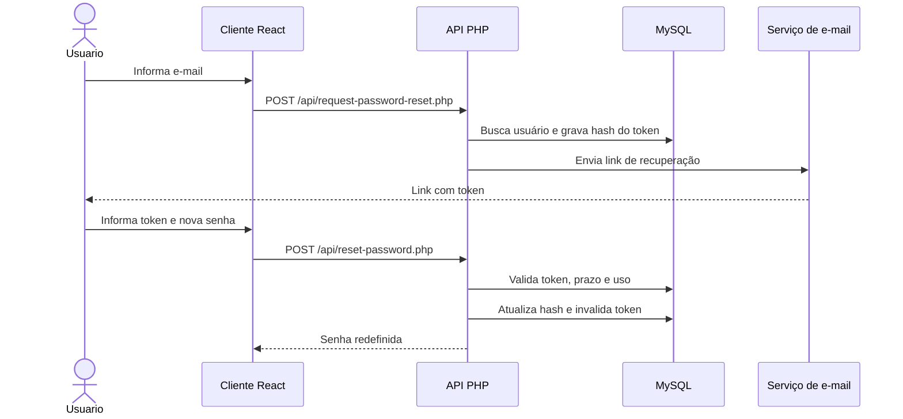

# Etapa 2: Recuperação de Senha

## 1. Identificação

**Projeto:** Continuum  
**Escopo:** requisitos 2.1 a 2.7 da rubrica de segurança.

Este documento trata exclusivamente da recuperação de senha. O fluxo possui uma base de backend preparada, mas ainda depende da execução da migração do banco, da integração completa das telas e da configuração de envio de e-mail para ser considerado concluído em produção.

## 2. Objetivo

Permitir que o usuário redefina a senha sem expor a existência de contas, armazenando somente o hash do token temporário, controlando sua validade, invalidando-o após o uso e registrando os eventos do processo sem guardar credenciais sensíveis.

## 3. Fluxo planejado

1. O usuário informa o e-mail na tela de recuperação.
2. A API responde de forma genérica, sem revelar se o e-mail existe.
3. Para uma conta existente, o servidor gera um token com `random_bytes`.
4. Somente o hash SHA-256 do token é armazenado em `password_reset_tokens`.
5. O token expira após 30 minutos.
6. O link deve ser enviado por e-mail em ambiente configurado.
7. A API valida o token, a expiração e o uso anterior.
8. A nova senha é armazenada com Argon2id.
9. O token é marcado como utilizado na mesma operação.
10. Solicitações, sucessos, falhas e expirações são registrados sem armazenar o token original ou a senha.



## 4. Arquivos relacionados

| Arquivo | Responsabilidade | Estado |
| --- | --- | --- |
| `apps/Server/api/request-password-reset.php` | Geração e persistência do token | Implementado para desenvolvimento |
| `apps/Server/api/reset-password.php` | Validação do token e alteração da senha | Implementado para desenvolvimento |
| `apps/Server/config/password_reset.sql` | Criação da tabela de tokens | Deve ser executado no MySQL |
| `apps/Client/src/pages/password/index.jsx` | Solicitação de recuperação | Precisa apontar para o novo endpoint |
| `apps/Client/src/pages/new_senha/index.jsx` | Definição da nova senha | Precisa enviar o token da URL |
| `apps/Server/var/log/password-recovery.log` | Registro dos eventos | Criado durante as solicitações |

## 5. Matriz de conformidade

| Nº | Requisito | Status | Evidência ou pendência |
| --- | --- | --- | --- |
| 2.1 | Funcionalidade de recuperação de senha implementada | **Parcial** | Os endpoints existem, mas as telas ainda precisam ser integradas e a migração executada. |
| 2.2 | Token criptograficamente seguro | **Atendido no backend** | O token é gerado com `random_bytes` e somente seu hash é armazenado. |
| 2.3 | Token com tempo de expiração | **Atendido no backend** | O token expira após 30 minutos e a consulta valida `expira_em`. |
| 2.4 | Token invalidado após uso | **Atendido no backend** | `usado_em` é preenchido após a redefinição bem-sucedida. |
| 2.5 | Falha correta para token expirado | **Atendido no backend** | Tokens inválidos, expirados ou usados recebem erro controlado. |
| 2.6 | Registro de solicitação de recuperação em log | **Atendido no backend** | O log registra evento, hash do e-mail e resultado, sem armazenar o token. |
| 2.7 | Registro de sucesso ou falha do processo | **Atendido no backend** | Solicitações, erros, tokens inválidos e redefinições são registrados. |

## 6. Pendências para conclusão

- Executar `apps/Server/config/password_reset.sql` no banco `continuum`.
- Integrar a tela de solicitação ao endpoint `request-password-reset.php`.
- Integrar a tela de nova senha ao endpoint `reset-password.php`.
- Configurar PHPMailer e credenciais SMTP em variáveis de ambiente.
- Remover o link de desenvolvimento antes da publicação em produção.
- Testar token válido, expirado, inválido e reutilizado.
- Confirmar que o diretório de logs possui permissão adequada e não é público.

## 7. Evidências

As imagens e registros dos testes devem ser adicionados à pasta `docs/Evidencias/`.

Sugestão de arquivos:

```text
docs/
└── Evidencias/
	├── 08-solicitacao-recuperacao.png
	├── 09-link-de-recuperacao.png
	├── 10-token-expirado.png
	├── 11-token-invalido.png
	├── 12-token-uso-unico.png
	├── 13-senha-redefinida.png
	└── 14-logs-recuperacao.md
```

Não incluir no GitHub senhas reais, tokens válidos, links utilizáveis ou dados pessoais reais.

## 8. Referências técnicas

1. OWASP Foundation. **Forgot Password Cheat Sheet**. Disponível em: <https://cheatsheetseries.owasp.org/cheatsheets/Forgot_Password_Cheat_Sheet.html>. Acesso em: 6 set. 2026.
2. OWASP Foundation. **Password Storage Cheat Sheet**. Disponível em: <https://cheatsheetseries.owasp.org/cheatsheets/Password_Storage_Cheat_Sheet.html>. Acesso em: 6 set. 2026.
3. PHP. **random_bytes**. Disponível em: <https://www.php.net/manual/en/function.random-bytes.php>. Acesso em: 6 set. 2026.
