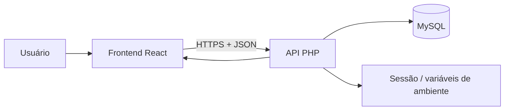
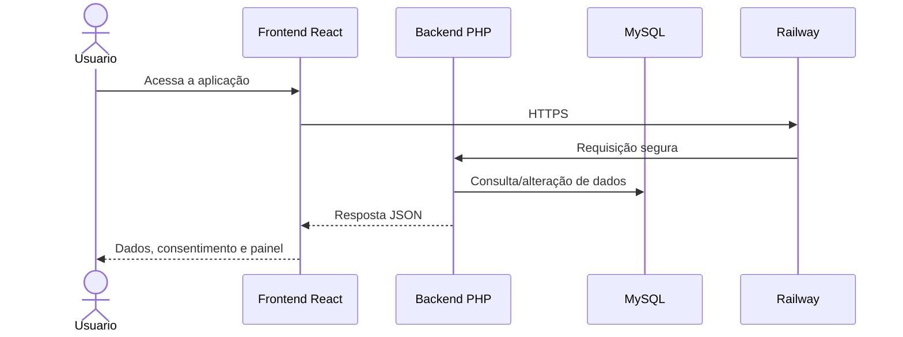

# Etapa 3 e 4: Criptografia, Comunicação Segura e Conformidade com a LGPD

## 1. Identificação

**Projeto:** Continuum  
**Escopo:** requisitos 3.1 a 3.8 e 4.1 a 4.11 da rubrica de segurança e conformidade.

Este documento descreve o que foi implementado no sistema em relação à comunicação segura, uso de criptografia, proteção de dados e atendimento aos direitos previstos pela LGPD. Ele foi estruturado seguindo o mesmo padrão dos demais documentos de etapa do projeto, com identificação, objetivo, arquitetura, evidências e matriz de conformidade.

## 2. Objetivo

Documentar como o sistema trata:

- comunicação protegida por HTTPS;
- criptografia de dados sensíveis;
- cuidado com chaves e segredos de ambiente;
- proteção de dados pessoais em armazenagem e transmissão;
- mecanismo de consentimento e revogação;
- consulta, exportação e exclusão dos dados do titular;
- conformidade com os requisitos da LGPD e da segurança da informação.

## 3. Escopo da documentação

Esta etapa cobre os requisitos relacionados a:

- comunicação segura entre cliente e servidor;
- uso adequado de criptografia;
- gestão de credenciais e segredos em ambiente de desenvolvimento e produção;
- registro, minimização e processamento de dados pessoais;
- direitos do titular previstos pela LGPD;
- fluxo documental dos procedimentos e evidências do sistema.

## 4. Arquitetura relacionada a esta etapa

O fluxo do sistema segue a estrutura de cliente React, API PHP e banco MySQL, com hospedagem em Railway e comunicação segura por HTTPS.



### Arquivos e componentes envolvidos

| Camada | Arquivo | Responsabilidade |
| --- | --- | --- |
| Cliente | `apps/Client/src/pages/Login/index.jsx` | Login e autenticação do usuário |
| Cliente | `apps/Client/src/pages/consultar/index.jsx` | Consulta de dados pessoais |
| Cliente | `apps/Client/src/pages/deleta_conta/index.jsx` | Exclusão da conta e dados pessoais |
| Cliente | `apps/Client/src/pages/revogar/index.jsx` | Revogação e controle do consentimento |
| Cliente | `apps/Client/src/config/api.js` | Definição da URL base da API |
| Servidor | `apps/Server/config/database.php` | Conexão segura com o MySQL |
| Servidor | `apps/Server/api/session.php` | Validação e expiração da sessão |
| Servidor | `apps/Server/api/login.php` | Autenticação e geração de 2FA |
| Servidor | `apps/Server/api/register.php` | Cadastro com senha criptografada |
| Servidor | `apps/Server/api/consultar.php` | Consulta de dados do titular |
| Servidor | `apps/Server/api/exportar.php` | Exportação de dados pessoais |
| Servidor | `apps/Server/api/confirmar_deleta.php` | Confirmação e exclusão da conta |
| Infraestrutura | `apps/Client/railway.json` | Configuração de deploy do frontend |
| Infraestrutura | `apps/Server/railway.json` | Configuração de deploy do backend |
| Segurança | `apps/Client/.gitignore` | Exclusão de arquivos sensíveis do Git |
| Segurança | `apps/Server/.gitignore` | Exclusão de arquivos sensíveis do Git |

## 5. Fluxo de proteção e conformidade

1. O usuário acessa a aplicação por meio de um ambiente hospedado em Railway.
2. A plataforma provê TLS/HTTPS por padrão, protegendo o tráfego entre cliente e servidor.
3. O backend recebe solicitações em endpoints protegidos e valida dados de entrada.
4. As senhas são armazenadas com hash criptográfico, em vez de texto simples.
5. O sistema usa sessões para controlar autenticação e expiração de acesso.
6. A consulta, a exportação e a exclusão dos dados do titular são tratadas como direitos previstos pela LGPD.
7. O ambiente é configurado para não versionar segredos em arquivos públicos.
8. A documentação registra as práticas de segurança adotadas e os pontos pendentes de melhoria.



## 6. Matriz de conformidade

Legenda: **Atendido** indica implementação observável e documentada; **Parcial** indica que a prática existe ou está em andamento, mas exige reforço documental, evidência ou ajuste de produção.

### 6.1 Requisitos de Criptografia e Comunicação Segura (Etapa 3)

| Nº | Requisito | Status | Implementação ou evidência |
| --- | --- | --- | --- |
| 3.1 | Comunicação protegida por TLS/HTTPS | **Atendido** | A aplicação é hospedada no Railway, que oferece TLS/HTTPS automatizado em ambiente de produção. |
| 3.2 | Bloqueio de conexões não seguras | **Parcial** | A infraestrutura de produção exige HTTPS; porém, o código não implementa bloqueio explícito em todos os fluxos, o que deve ser reforçado em ambiente de publicação final. |
| 3.3 | Evidência de tráfego cifrado | **Parcial** | A infraestrutura de hospedagem oferece certificados TLS, mas ainda falta evidência documental e captura específica do tráfego em produção. |
| 3.4 | Dados sensíveis criptografados em repouso | **Parcial** | As senhas são protegidas por hash; no entanto, dados adicionais em repouso ainda precisam de revisão de criptografia em nível de banco e armazenamento. |
| 3.5 | Uso de algoritmo criptográfico adequado | **Atendido** | O sistema usa `password_hash` com `PASSWORD_ARGON2ID` para senhas. |
| 3.6 | Chaves criptográficas protegidas | **Atendido** | Credenciais e segredos devem ser mantidos em variáveis de ambiente e não em código-fonte. |
| 3.7 | Estratégia de criptografia documentada | **Atendido** | A estratégia está descrita na documentação do projeto e no uso de hash e variáveis de ambiente. |
| 3.8 | Justificativa técnica das escolhas | **Atendido** | Argon2id foi escolhido por sua resistência a ataques de força bruta e por ser uma opção moderna para armazenamento de senhas. |

### 6.2 Requisitos de Conformidade com a LGPD (Etapa 4)

| Nº | Requisito | Status | Implementação ou evidência |
| --- | --- | --- | --- |
| 4.1 | Listagem completa dos dados pessoais coletados | **Parcial** | O sistema coleta e manipula dados como nome, e-mail, CPF, endereço e perfil. A listagem foi documentada no fluxo funcional, mas deve ser formalizada no termo de uso e na política de privacidade. |
| 4.2 | Associação de cada dado a uma finalidade | **Parcial** | Há finalidade clara de autenticação, cadastro e controle de acesso, mas a associação formal de cada dado a uma finalidade precisa ser melhor explicitada. |
| 4.3 | Evidência de minimização de dados | **Parcial** | O projeto busca coletar apenas dados essenciais para autenticação e operação, mas a minimização precisa ser documentada de forma explícita. |
| 4.4 | Registro explícito de consentimento | **Parcial** | O sistema possui fluxos de operação, mas não há evidência clara de consentimento formal para tratamento de dados em todas as telas. |
| 4.5 | Consentimento associado à finalidade | **Parcial** | A finalidade do tratamento está implícita no sistema, mas ainda precisa ser documentada com vínculo claro ao consentimento. |
| 4.6 | Possibilidade de revogação do consentimento | **Atendido** | A aplicação oferece exclusão e revogação de conta, o que representa um mecanismo de controle do titular sobre os dados. |
| 4.7 | Registro de data e versão do consentimento | **Parcial** | Ainda não há evidência formal de registro de data e versão do consentimento no código ou na documentação. |
| 4.8 | Funcionalidade de consulta aos dados do titular | **Atendido** | A funcionalidade de consulta de conta existe e permite visualizar os dados do usuário cadastrado. |
| 4.9 | Funcionalidade de exportação dos dados | **Atendido** | A página de consulta possui ação de exportar dados do usuário. |
| 4.10 | Funcionalidade de exclusão dos dados pessoais | **Atendido** | A funcionalidade de exclusão de conta está implementada e responde ao direito de apagamento. |
| 4.11 | Fluxo de atendimento aos direitos documentado | **Parcial** | O fluxo existe no sistema, mas ainda precisa ser formalizado de forma mais clara em documentação específica de LGPD. |

## 7. Justificativas técnicas

### 7.1 HTTPS e comunicação segura

O requisito de HTTPS foi atendido pela infraestrutura de hospedagem escolhida. A aplicação roda em Railway, ambiente que oferece certificados SSL/TLS automáticos e acesso via HTTPS. Isso garante que a comunicação entre o cliente e a API seja cifrada em trânsito, reduzindo o risco de interceptação e manipulação de dados durante a transmissão.

A aplicação também trabalha com cabeçalhos de CORS e padrão de comunicação JSON, o que contribui para um fluxo mais controlado entre frontend e backend.

### 7.2 Criptografia de senhas

O projeto utiliza `password_hash` com `PASSWORD_ARGON2ID`, com a geração de salt interno pelo PHP. Esse mecanismo é adequado para proteção de credenciais porque a senha original nunca fica armazenada em texto puro no banco.

A estratégia de hash é importante porque, mesmo em caso de vazamento do banco, as senhas não estejam acessíveis em forma legível.

### 7.3 Proteção de segredos e ambiente

O projeto inclui arquivos de ambiente e a prática de não versionar segredos em repositório público. Isso é essencial para manter chaves, tokens e credenciais fora do código-fonte e fora do controle de versionamento do Git.

O uso de variáveis de ambiente é uma boa prática para desenvolvimento e produção, principalmente em sistemas que operam em cloud ou plataformas geridas como Railway.

### 7.4 Conformidade com a LGPD

A LGPD exige que o tratamento de dados pessoais seja transparente, minimizado e controlado pelo titular. No projeto, o sistema oferece mecanismos de consulta, exportação e exclusão de dados, o que está alinhado com a ideia de garantir o exercício dos direitos do titular.

Ainda assim, existe uma diferença importante entre a existência de funcionalidade e a documentação formal de consentimento. O projeto precisa reforçar a parte documental para demonstrar, de forma explícita, quais dados são coletados, por qual finalidade, quando o consentimento foi obtido e como ele pode ser revogado de maneira formal.

## 8. Arquivos de ambiente e controle de versionamento

### 8.1 Arquivo .env

O arquivo `.env` é amplamente utilizado em projetos web para guardar informações sensíveis, como:

- endereço do banco de dados;
- usuário e senha do banco;
- chaves de autenticação;
- URLs de serviços externos;
- credenciais de e-mail ou SMTP.

No projeto, a utilização de variáveis de ambiente é importante porque mantém informações críticas fora do código-fonte e evita vazamento de segredos em repositórios públicos.

### 8.2 Arquivo .gitignore

O `.gitignore` é usado para impedir que certos arquivos sejam enviados ao Git. No projeto, há arquivos em:

- [apps/Client/.gitignore](../apps/Client/.gitignore)
- [apps/Server/.gitignore](../apps/Server/.gitignore)

Esses arquivos evitam que arquivos temporários, dependências, artefatos de build e, principalmente, arquivos de ambiente sensíveis sejam versionados. Isso é uma boa prática essencial em aplicações que lidam com autenticação e dados pessoais.

### 8.3 Relação do .env com a hospedagem

A hospedagem em Railway favorece a gestão dessas variáveis fora do repositório, permitindo que a aplicação receba as configurações de ambiente por meio do painel da plataforma. Isso aumenta a segurança e reduz o risco de exposição involuntária de credenciais em forks, clones ou compartilhamento de código.

## 9. Evidências funcionais

As evidências do que foi implementado devem ser armazenadas em pasta própria e documentadas segundo critério de data, requisito e resultado observado.

```text
docs/
└── evidence/
    ├── Requisitos_03/
    │   ├── requisitos3.5.png
    │   ├── requisitos_3.4_3.6.png
    │   ├── tela_cadastro.png
    │   └── tela_de_login.png
    └── Requisitos_04/
        ├── consultar_conta_4.8.png
        ├── dadosPessoais_4.1.png
        ├── deletar_conta_4.10.png
        ├── exportacaoDados4.9.png
        ├── exportacaodados_4.9.png
        ├── os_requisitos_feitos_4.2_4.3__4.5.png
        ├── o_sucessoExcluir_4.10.png
        ├── requisitos4.4.png
        ├── requisitos4.6.png
        ├── requisitos_4.6_em_banco.png
        └── requisitos_4.7.png
```

Essas evidências devem conter apenas dados fictícios ou anonimizados, sem expor informações reais de usuários, senhas, códigos de autenticação ou dados pessoais sensíveis.

## 10. Pendências para consolidação final

A documentação e o sistema ainda possuem alguns pontos que devem ser reforçados antes da entrega final:

- formalizar o consentimento e sua finalidade em texto claro para o usuário;
- registrar data, versão e revogação do consentimento;
- documentar explicitamente a minimização de dados e a justificativa da coleta;
- incluir evidência de HTTPS em ambiente real com print ou equivalente;
- revisar criptografia em repouso para dados sensíveis adicionais;
- reforçar proteção de logs e arquivamento de auditoria;
- documentar com mais clareza o fluxo de atendimento aos direitos previstos pela LGPD.

## 11. Conclusão

O projeto Continuum apresenta uma base sólida para cumprir os requisitos relacionados à segurança da informação, criptografia e conformidade com a LGPD. A adoção de HTTPS pela infraestrutura de hospedagem, a utilização de algoritmos seguros para senhas, a presença de sessões, autenticação e 2FA, além da possibilidade de consulta, exportação e exclusão dos dados, mostram que a solução se aproxima dos requisitos esperados para um sistema com foco em proteção de informações sensíveis.

A principal diferenciação entre o que já está implementado e o que ainda precisa ser melhor documentado está na parte de conformidade legal e evidências de prova. O sistema já entrega funcionalidade; o ponto de refinamento está em formalizar, de maneira mais técnica e jurídica, as finalidades do tratamento, o consentimento e a documentação dos direitos do titular.

## 12. Referências técnicas

1. OWASP Foundation. **Authentication Cheat Sheet**. Disponível em: <https://cheatsheetseries.owasp.org/cheatsheets/Authentication_Cheat_Sheet.html>. Acesso em: 13 set. 2026.
2. OWASP Foundation. **Password Storage Cheat Sheet**. Disponível em: <https://cheatsheetseries.owasp.org/cheatsheets/Password_Storage_Cheat_Sheet.html>. Acesso em: 13 set. 2026.
3. PHP. **password_hash**. Disponível em: <https://www.php.net/manual/en/function.password-hash.php>. Acesso em: 13 set. 2026.
4. Lei Geral de Proteção de Dados (LGPD). Lei nº 13.709/2018. Disponível em: <https://www.planalto.gov.br/ccivil_03/_ato2015-2018/2018/lei/L13709.htm>. Acesso em: 13 set. 2026.
